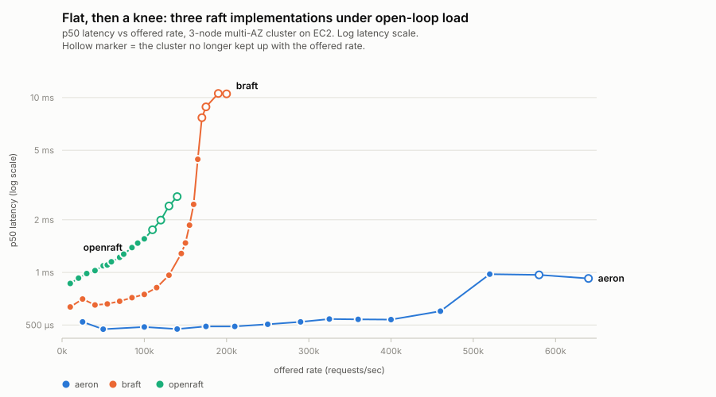
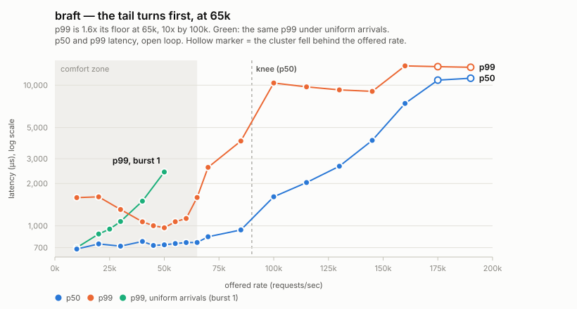
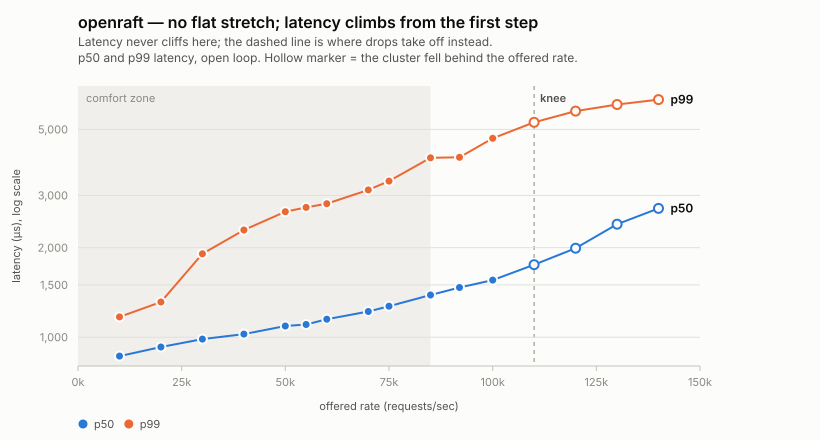
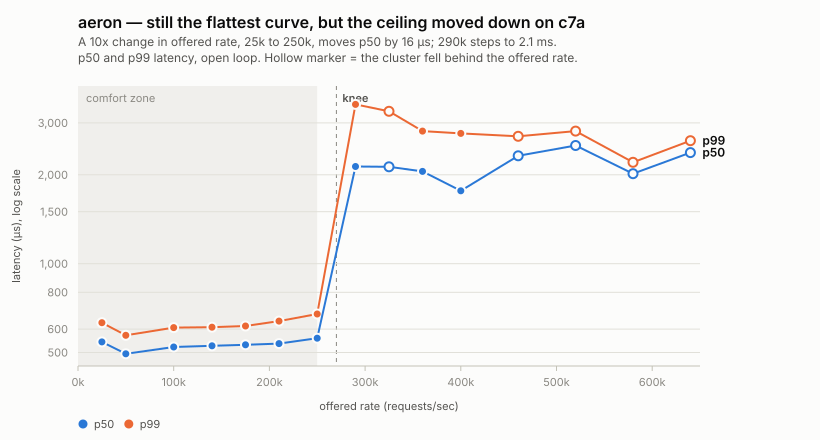

# Performance tests for implementations of Raft consensus

Monorepo for performance tests of RAFT protocol implementations. Each
subdirectory is one implementation under test, with its own build/run/benchmark
instructions in its own README:

- [`braft/`](braft/) — braft (C++, brpc), replicated atomic counter
- [`openraft/`](openraft/) — openraft (Rust), HTTP key-value store
- [`aeron/`](aeron/) — Aeron Cluster (Java, UDP), echo service

The AWS harness below is shared across all of them.

## AWS harness

Provisions a small EC2 fleet — 3 raft nodes + 1 command-and-control instance
running the load generator — in a single AWS account/region (us-east-1),
reusable across whichever product's `Makefile` you drive it with.

Prerequisites: terraform, an AWS profile with us-east-1 access, an ssh key
pair.

```sh
make deploy        # terraform apply -var-file=deploy/single_az.tfvars (TOPOLOGY=single_az by default)
make env           # write EC2 IPs from terraform state into .env (gitignored)
make node-rtt       # measure real inter-node RTT
make destroy        # tear everything down
```

`.env` (see `.env.example`) holds the shared IPs/ssh config and is read by
both this root `Makefile` and each product's own `Makefile` (via `-include
../.env`). Product-specific run knobs (ports, batch sizes, thread counts,
...) live in each product's own README/Makefile, not here.

### Topology: single-AZ vs. multi-AZ

`TOPOLOGY` selects a `deploy/*.tfvars` file and controls where the 3 raft
nodes and the client land:

- `single_az` (default, `deploy/single_az.tfvars`): all 4 instances in one
  cluster placement group in one AZ — the low-latency floor.
- `multi_az` (`deploy/multi_az.tfvars`): the 3 raft nodes spread across
  `node_azs` (default `us-east-1a`/`1b`/`1c`); the client stays colocated with
  `node[0]`/`NODE1` in its own 2-instance cluster placement group. AWS cluster
  placement groups are AZ-scoped, so there's no way to keep all 4 instances in
  one PG once the nodes are spread out — `node[1]`/`node[2]` are plain
  instances in their own AZs.

```sh
make deploy TOPOLOGY=multi_az   # reapplies in place: only the 2 nodes whose
                                 # AZ changed get replaced, node[0] + client don't
make env                        # refresh .env with the new IPs
```

`make deploy TOPOLOGY=single_az` switches back the same way. Always pass the
same `TOPOLOGY` to `deploy`/`destroy`/`plan` you last deployed with — it
selects which `.tfvars` file describes the current state.

AWS doesn't publish which AZs are physically closest to each other (and AZ
*names* map to different physical zone-ids per account, so general advice
doesn't transfer), so `node_azs` defaults to `1a`/`1b`/`1c` rather than a
guess. `make node-rtt` pings between the deployed nodes (works in either
topology) so you can see the real numbers and swap in `1d`/`1e`/`1f` if one
leg is a clear outlier.

### What `make node-rtt` actually measures

Node-to-node only — not your dev machine, and not the client/C&C instance:

1. Your dev machine `ssh`es into each of `NODE1`/`NODE2`/`NODE3` (public IPs)
   in turn. That ssh hop is purely a remote-execution mechanism, not
   something being timed.
2. Once connected, it runs `ping` **on that remote node**, targeting the
   other two nodes' **private IPs**.
3. The reported RTTs are strictly the pairwise latency between the 3 raft
   nodes themselves over their private VPC network — exactly the
   leader→follower replication path.

Your dev machine's own latency to AWS never factors into the numbers, and
the client/C&C instance is never a ping source or target — its latency to
the leader isn't measured by this tool.

### Instance types

`deploy/main.tf` defaults both `node_instance_type` and `client_instance_type`
to `c6i.2xlarge` (8 vCPU, no local NVMe, not network-optimized). That's the
right default for any raft implementation being benchmarked without fsync on
small messages — network bandwidth and packet rate aren't the bottleneck at
that scale, so `c6in` buys nothing, and no fsync means no need for local
NVMe. If your test needs synchronous disk writes, switch to `c6id.2xlarge` —
its instance-store NVMe is auto-mounted at `/data` by the node user-data
script (tens of microseconds per fsync vs. 0.5–1 ms on EBS). Override either
var with `-var` on `terraform apply`, or edit the defaults in `deploy/main.tf`.

Instances run Ubuntu 22.04, chosen to match the glibc of binaries built on a
typical Ubuntu 22 dev machine — build locally, `scp` the binary as-is.

### Node stats / product ports

Each product gets its own CIDR-scoped ingress rule in `deploy/main.tf`,
opened to `ssh_ingress_cidr` only (same CIDR as ssh) so you can reach it
directly from your own machine — separate from the self-referencing rule
that already covers client↔node traffic on any port for the benchmark
itself to run:

- `raft_port` (default `8300`) — braft's brpc server; both RPC traffic and
  its builtin HTTP stats pages multiplexed on the same port.
- `openraft_api_port` (default `21001`) — `raft-key-value`'s client-facing
  HTTP API (`/metrics`, `/write`, `/read`, ...).

Aeron Cluster has no such rule because it serves no HTTP status endpoint —
there is nothing useful to reach from outside the cluster.

If a product's server binds a different port than its variable's default,
override it with `-var <name>=<port>` on `terraform apply` to match. Adding
a new product with its own port follows the same pattern — a new variable
plus a matching ingress rule.

## Adding a new raft product

1. Create a new subdirectory with your build files and a `Makefile` that
   does `-include ../.env` and `include ../common.mk` (for `SSH_USER`,
   `SSH_KEY`, `SSH_OPTS`, `NODES`).
2. Add product-specific targets there: `push` (scp binaries), `start`/`stop`
   (run the server), `client` (run your load generator), `logs`. The three
   existing Makefiles cover fairly different shapes, so one of them is
   probably close to what you need:
   - `braft/Makefile` — one TCP port per node, static peer config
   - `openraft/Makefile` — two TCP ports per node, membership configured at
     runtime via an extra `init-cluster` step
   - `aeron/Makefile` — a 100-port UDP block per node, static membership, and
     a `provision` target because it needs a JVM installed on the instances
3. Deploy/tear down the shared fleet from the repo root as above; run your
   product's own targets from its subdirectory.

Keep the reporting line in the same shape the existing three use
(`... at qps=<X> latency=<Y>` in microseconds, over a one-second rolling
window), support both load modes (below), and default `THREADS` to 100 as they
all do, so results can be read side by side. 100 outstanding requests is the
common comparison point for closed mode: every product is latency-bound there
rather than resource bound, so `qps ≈ THREADS ÷ latency` holds and the two
numbers are two views of the same measurement.

## Load modes

Every product's `make client` takes `MODE=closed` (default) or `MODE=open`.
They answer different questions and neither substitutes for the other.

**`MODE=closed THREADS=N`** keeps N requests outstanding, so offered load adapts
to how fast the cluster answers. It measures the service latency one
well-behaved client experiences. By construction it *cannot* see saturation:
past the knee it simply stops offering more load, so latency flattens and
throughput caps. Publishing only closed-loop numbers overstates resilience.

**`MODE=open RATE=R`** emits on a fixed schedule at R requests/sec whether or
not replies have arrived, because real arrivals do not slow down when the system
does — they often increase. Latency is measured from each request's **scheduled**
send time, not the moment it actually went out, so any time spent waiting to
send is charged to the system. That one rule is what makes open mode immune to
coordinated omission, and it is the first thing to check in any implementation
here.

Supporting flags, shared across products: `BURST` (messages per scheduled
instant — same mean rate, clustered arrivals, for probing burst absorption; it
turned out to matter more than expected, see
[arrival shape](#comfort-zones)),
`MAX_INFLIGHT` (bounds unanswered requests; hitting it counts as
*dropped-by-rig* and a nonzero count invalidates the run's offered-rate claim
rather than being silently skipped), `WARMUP`/`MEASURE`/`DRAIN_TIMEOUT`, `PACE`
(`spin` for a client with a spare core, `park` on a shared box), and `HDR_OUT`.

Each run ends with a summary carrying p50/p90/p99/p99.9/p99.99/max from an
HdrHistogram, achieved rate, dropped-by-rig, and — in open mode — **schedule
lag**, covered in its own section below. Closed mode instead reports a
Little's-law ratio (`throughput × mean ÷ outstanding`, explained below) and flags
deviation over 10%, a cheap check that the rig measured what it thinks it did.

### What actually differs: what triggers the next send

Not synchronous versus asynchronous RPC. The difference is **what decides when
request *i+1* goes out**:

- **Closed loop: a reply does.** Each of N senders runs a loop — build, send,
  block until the reply, record, repeat. The offered rate is an *output* of the
  run, whatever `N ÷ latency` happens to be. The number outstanding is the input,
  pinned at N.
- **Open loop: the clock does.** `t_sched(i) = t_start + i/R`, fixed before the
  run and never adjusted. The offered rate is the *input*. The number outstanding
  is the output, whatever the cluster's behaviour makes it.

braft answers the obvious objection — *doesn't its client wait for the response,
like a closed loop?* — concretely, because both modes call the same method on the
same stub and differ in one argument.

Closed mode, [braft/client.cpp:161](braft/client.cpp#L161):

```cpp
stub.compare_exchange(&cntl, &request, &response, NULL);
```

A `NULL` done-closure is brpc's synchronous form: it blocks the calling bthread
until the reply lands. So yes — in closed mode the client really does wait, on
every request. That is not an artifact to work around, it *is* the mode. Two
things follow. Latency is timed from the actual send
([client.cpp:194](braft/client.cpp#L194)), which is the honest choice here because
the sender was not trying to send any earlier — there is no waiting to charge to
anyone. And each sender is a strictly serial chain: request *i+1*'s
`expected_value` is the value request *i* returned
([client.cpp:182-190](braft/client.cpp#L182-L190)), a compare-exchange chain per
sender, on its own key. So `THREADS=100` is 100 independent serial chains with
exactly one request in flight each — that is where "100 outstanding" comes from,
and why the number outstanding cannot vary during a closed-mode run.

Open mode, [braft/client.cpp:304](braft/client.cpp#L304):

```cpp
stub.compare_exchange(&call->cntl, &call->request, &call->response,
                      brpc::NewCallback(on_open_response, call));
```

A non-`NULL` done-closure makes the identical call return immediately. The reply
arrives later on a brpc bthread worker, which runs `on_open_response` and records
`now_us() - call->scheduled_us` there ([client.cpp:236](braft/client.cpp#L236)).
The scheduler thread never touches a reply; it only ever waits on the clock. Per
request state (controller, request, response, `scheduled_us`) has to outlive the
call, so it lives in a heap-allocated `OpenCall` that the callback deletes.

**Little's law, briefly.** For any stable system, `L = λ × W`: the average number
of requests in flight equals the arrival rate times the average time each spends
in the system. It says nothing about consensus or networks — it is arithmetic that
holds whenever what goes in comes out. It is also why the two modes are duals.
Closed loop pins `L` at N, so λ and W can only trade off against each other: when
the cluster slows down, throughput falls and the client offers less. Open loop
pins λ at R, so `L` and W trade off instead: when the cluster slows down, the
backlog grows and latency grows with it. Same law, different variable held fixed,
which is why the two see different things at saturation. It doubles as a
self-check — in closed mode `throughput × mean latency ÷ outstanding` must come
out at 1.0, and a deviation over 10% means the rig is not measuring what it
thinks it is.

**Why the trigger, and not the RPC style, is the thing that matters.** You can
build an open loop out of synchronous calls by giving each request its own
thread, and plenty of load generators do. What makes a rig open-loop is that
nothing in the send path is allowed to wait on a reply; async is just how you
achieve that without one thread per in-flight request. Little's law says how many
that would be: at aeron's 640k and ~900 µs, about 580 outstanding; at braft's
190k and 11 ms, about 2,000 — the same order as braft's `MAX_INFLIGHT=2000`, and
the reason thread-per-request does not scale to these rates.

**And why it makes coordinated omission structural rather than accidental.**
Stall the leader for 500 ms mid-run:

- *Closed loop*: all N senders are blocked in `compare_exchange`. The client
  issues **nothing** for 500 ms, then records N samples of roughly 500 ms each.
  The 500 ms × R requests a real workload would have sent during the stall are
  simply absent from the sample — omitted, in coordination with the failure.
  Throughput shows a dip; the tail hardly moves.
- *Open loop*: the scheduler is not blocked, so it keeps issuing at R. Those
  500 ms × R requests all get sent, and each records a latency covering its share
  of the stall.

Measured, not asserted: under a 500 ms `kill -STOP`, braft's open mode held
`qps=1000` throughout and recorded a 614 ms maximum. Closed mode on the same
stall does the opposite — aeron's count fell from ~1500/s to 45/s and it recorded
a single sample for the whole stall instead of hundreds. Full results are in the
verification table further down. That contrast is the reason to run both modes.

### Schedule lag: the rig auditing itself

`lag = actual send time − t_sched`, recorded per request into its own
HdrHistogram during the measurement window only
([client.cpp:301](braft/client.cpp#L301)), reported as p50 / p99 / max.

It exists because open mode's central rule creates an exposure. Latency runs from
`t_sched` to the reply, and **the rig itself sits inside that interval**. If the
client is 200 µs late issuing a request, the reported latency contains 200 µs the
cluster never caused. Latency alone cannot tell "the cluster is slow" from "my
client was late." Schedule lag can, and it is the reason to trust the numbers at
all. It is not a nice-to-have: a large lag invalidates the offered-rate claim in
the same way dropped-by-rig does, because both are the rig failing to deliver
rate R.

Read it against the latency it accompanies. In these sweeps braft ran 14–19 µs at
p50 against latencies of 700 µs and up — about 2% — and openraft and aeron ran
0–1 µs. At 0–1 µs the reported figures are the cluster's, full stop. The
cautionary case is the same rigs on a 4-core laptop: 159–229 µs of lag, and
cross-mode agreement unreachable, which is why open mode wants a client with a
spare core.

**What makes it non-zero is mostly `BURST`, not pacing.** From
[sweep/braft-burst.csv](sweep/braft-burst.csv), same rates and same pacing:

| | lag p99 across runs |
|---|---|
| `BURST=1` | 1–15 µs |
| `BURST=10` | 25–42 µs |

All ten requests in a burst share one scheduled instant, so they are all measured
against the same `t_sched` — but they still have to be issued one after another,
and the tenth pays for issuing the previous nine. At a couple of µs per async brpc
issue that is the 25–42 µs. openraft and aeron read 0–1 µs because their issue
paths are cheaper (a spawn onto a runtime, and an `offer()` into a ring buffer).

Two things follow. The lag is a real cost, correctly attributed — those requests
genuinely did go out late, and the rule says charge it. And it bounds how much of
the [arrival-shape finding](#comfort-zones) could be rig error: at 10k, `BURST=10`
costs about 900 µs of p99 against at most 42 µs of lag, so the rig accounts for
under 5% of it. The rest is the cluster.

`PACE` controls how the scheduler waits for the next instant: `spin` stays on-core
for precision, `park` sleeps in 50 µs steps while more than 150 µs remain
([client.cpp:263](braft/client.cpp#L263)) and hands the core back. On a client
box with a spare core, spin; on a shared one, park and check the lag.

### Cross-mode agreement, and what it validates

**Sanity check across modes.** Well below the knee the two modes should agree on
p50, since a lightly loaded system's service time should not depend on how
arrivals are spaced. Divergence usually means a rig bug — but not always: Aeron
diverged 5.8× because its default parking idle strategies make service time
depend on arrival *pattern*, not just rate. Check schedule lag before concluding
either way.

**Cross-mode agreement, measured on EC2.** For each product: a closed-loop run
at 28 outstanding to establish a rate well below the knee, then an open-loop run
at exactly that rate. Same 3-node multi-AZ fleet of `c6i.2xlarge`, one product at
a time so they never compete for CPU.

| Product | closed p50 | open p50 | delta | schedule lag p50 / max |
|---|---|---|---|---|
| braft | 745 µs @ 35,473/s | 804 µs @ 35,451/s | +7.9% | 1 µs / 38 µs |
| openraft | 986 µs @ 27,949/s | 1005 µs @ 27,926/s | +1.9% | 0 µs / 236 µs |
| aeron | 491 µs @ 56,840/s | 559 µs @ 56,839/s | +13.8% | 0 µs / 1453 µs |

All three inside the 15% criterion, with the rigs holding the offered rate to
within a handful of requests per second. Schedule lag of 0-1 µs at the median is
what makes the delta interpretable as the system's behaviour rather than the
rig's; the same runs on a 4-core laptop showed lag of 159-229 µs and could not
meet the criterion at all, which is why open mode wants a client with a spare
core.

Worth noting: aeron's two modes diverged **5.8×** on the laptop and agree to
13.8% here. That gap was its default parking idle strategies making service time
depend on arrival *pattern*; the EC2 configuration sets non-parking strategies
(`SPIN_IDLE`), and the arrival-pattern sensitivity goes away with it.

### The knee, and why it only shows up in open loop

Every system has a rate below which it keeps up comfortably and above which it
stops. The **knee** is that transition. Below it, a request's latency is service
time: it arrives, gets processed, leaves. Above it, requests arrive faster than
they can be retired, so each one waits behind a growing backlog and latency stops
describing the work and starts describing the queue — measured latency becomes
queue depth expressed in time.

Three signals mark it, and they don't arrive together:

1. **p50 starts climbing** while throughput still tracks the offered rate.
2. **The tail breaks first.** p99 can blow out while p50 still looks healthy —
   braft's p99 goes 1070 → 2603 → 4009 µs across 55k, 70k and 85k while its p50
   barely moves (748 → 836 → 935 µs). If you watch averages you miss this
   entirely.
3. **`achieved` falls below `RATE`**, and drops climb. The system is now
   definitively past capacity.

Closed loop cannot show any of this. Holding N requests outstanding means the
client only sends when the system replies, so offered load is throttled by the
system's own speed — at saturation it simply stops asking for more, latency
flattens, and throughput caps. That is coordinated omission as a property of the
measurement, and it is why the cliff below is only visible in open loop.



One pair of axes for all three has to span a 16× range of offered rate, which
squeezes braft and openraft into the left fifth of the plot and flattens the very
thing the chart is for. So each product also gets its own, over its own range of
rate and latency, with p50 and p99 plotted together — the tail turns first, so the
two curves separating *is* the knee:







Each was measured the same way: 10 s warmup, 30 s measurement window, one run per
rate, `MODE=open`. Steps are tightest inside each comfort zone and through the
knee — 5k apart for braft between 40k and 70k, 10k for openraft, 35–40k for aeron
— so the knee falls between steps rather than being straddled by one. 49 rows in
all. The raw data, the sweep script and the chart generator are in
[sweep/](sweep/), so every number below can be rechecked and the charts rebuilt
with `python3 sweep/mkcharts.py`.

### Batching: why Aeron's open-loop latency was 5× too high

Closed loop refills its window in a tight inner loop — `while (inFlight < N)
offer()` — so requests leave back-to-back. The transport sees a run of messages
and coalesces them: one syscall, one datagram, one pass through the pipeline for
many requests. Open loop paces requests to a schedule, so by default it offers
**one message per scheduled instant**, and that coalescing never happens.

For Aeron that difference dominated everything else. Its client publishes into a
single session, so unbatched offers meant a per-message trip through the driver:

| at 100k offered | p50 | p99 |
|---|---|---|
| `BURST=1` (one per instant) | 2613 µs | 13,901 µs |
| `BURST=10` (ten per instant) | **490 µs** | **600 µs** |

Same aggregate rate — ten messages every 100 µs instead of one every 10 µs — and
they still share the burst's scheduled timestamp, so the latency definition is
unchanged. The p99 improved 23×, and p50 came in *below* the closed-loop floor of
534 µs. An earlier revision of this file reported Aeron's knee at 185k; that was
this artifact, not Aeron. With batching the knee is ~460k, two and a half times
higher.

The effect is transport-specific, which is worth knowing before comparing
products:

| Product | effect of `BURST=10` at a fixed rate | why |
|---|---|---|
| aeron | 2613 → 490 µs | one session; unbatched offers pay full driver cost each |
| braft | 1613 → 1210 µs | brpc already pipelines per channel, so less left to win |
| openraft | 1320 → 1358 µs (none) | HTTP/1.1 needs a connection per request — nothing to batch onto |

Those were all measured at 100k. Batching's *sign* is not fixed, though — for
braft it flips below ~35k, where clumped arrivals cost more than they save. The
comfort-zone section below measures that.

### Comfort zones

Comfort zone here means: the rate is fully sustained, drops stay under ~0.1%, and
the tail is inside budget. **braft's bound is an explicit p99 budget of 3 ms** —
the last rate it holds that at is 70k (2603 µs; 85k is already 4009 µs), and the
budget is drawn on its chart so the zone edge is visibly derived from it. aeron
and openraft are still bounded by where their own curves turn, which is a
different rule, so the three edges are not strictly like-for-like. Applying the
same 3 ms budget to all of them would give aeron **~640k** (it never exceeds
1383 µs at any rate measured, so throughput bounds it, not latency) and openraft
**~60k** (2813 µs, against 3131 µs at 70k). Aeron gains under that rule and
openraft loses; say so if you want the table switched over.

| Product | comfort zone | p50 / p99 there | p50 floor | knee | max sustained |
|---|---|---|---|---|---|
| aeron | **~400k** | 537 / 705 µs | 473 µs @ 50k | ~460k | ~626k |
| braft | **~70k** | 836 / 2603 µs | 684 µs @ 10k † | 70k by the tail, ~90k by p50 | ~175k |
| openraft | **~85k** | 1387 / 4014 µs | 864 µs @ 10k | ~110k | ~128k |

† with the swept `BURST=10`; braft reaches 575 µs at 10k under uniform arrivals,
for reasons the burst section below covers.

Aeron's comfort zone is 5.7x braft's and nearly 5x openraft's, at under two
thirds of braft's p50 and a quarter of its p99 — which is the comparison this
sweep exists to establish.

Where inside its zone braft is run still matters, because the budget is a ceiling
and not a description of the whole range. p99 sits at 1070 µs at 55k and 2603 µs
at 70k: the last 27% of throughput costs 2.4x the tail. 70k is the most braft can
be asked for under a 3 ms budget, not the rate at which it is comfortable.
Settings per product: aeron `BURST=10 MAX_INFLIGHT=1000`; braft `BURST=10
MAX_INFLIGHT=2000`; openraft `MAX_INFLIGHT=400`, burst irrelevant.

**Idling the cluster does not buy much latency back — for two of the three.**
Dropping braft from its comfort-zone rate to 10k gains 152 µs, or 18% (30% if the
arrival shape is relaxed too — see below), and aeron is *slower* at 25k than at
50k. Consensus latency is dominated by a round trip that
does not get cheaper when the machine is idle, so for those two, most of the
comfort zone is capacity you can spend without paying for it in latency.
openraft is the exception: it gains 523 µs, or 38%, going from 85k to 10k — but
that is not a floor being approached, it is the same near-linear cost curve
described below, extended down. Its cheapest rate is simply its lowest one.

**braft's low-rate tail belongs to the arrival shape, not to braft.** On the braft
chart, p99 falls as load *rises* from 10k to 50k — 1583 µs down to about 1100 —
which is backwards. It reproduces tightly (three runs at 10k: 1601 / 1579 /
1570 µs; three at 50k: 1124 / 1103 / 1095 µs), so it is not noise, and a 40 s
warmup instead of 10 s changes nothing (1595 µs). It is `BURST=10`:

| offered | p50 burst 1 | p50 burst 10 | p99 burst 1 | p99 burst 10 |
|---|---|---|---|---|
| 10k | **586 µs** | 687 µs | **700 µs** | 1583 µs |
| 20k | **663 µs** | 744 µs | **875 µs** | 1607 µs |
| 25k | **678 µs** | — | **948 µs** | — |
| 30k | **694 µs** | 717 µs | **1073 µs** | 1307 µs |
| 40k | **734 µs** | 774 µs | 1498 µs | **1069 µs** |
| 50k | 792 µs | **732 µs** | 2414 µs | **1107 µs** |

Ten requests sharing one scheduled instant every 100 µs is a different workload
from one request every 10 µs, even though the mean rate is identical — and which
one braft prefers *depends on the rate*. Below ~35k, uniform arrivals win, and win
big: at 10k, `BURST=1` gives a p99 of 700 µs against 1583. Above ~35k the ordering
reverses and batching wins by as much. The two p99 curves cross at about 35k,
which is where the green series on the braft chart passes the orange one.

The clumped arrivals hurt at low rate because there is nothing else in the
pipeline to absorb them: a burst of ten either fits in the outgoing
append-entries round or splits across two, and the stragglers pay a second round
trip — 1583 µs is 2.3x the 687 µs median, roughly the shape of one extra round
trip. At 50k a round is always about to leave, so that penalty is amortized and
batching's savings dominate instead.

**Two consequences.** First, braft's real best case is better than anything in the
sweep above: **p50 586 µs, p99 700 µs** at 10k with `BURST=1`, averaged over two
runs — the better of them measured 575 / 685. Its p99 under uniform arrivals
essentially equals its p50 under clumped ones. Second, the swept curves hold
`BURST` fixed per product for comparability, which is the right call for comparing
products but means each curve is one arrival shape, not an envelope. Where the
shape matters — and for braft below 35k it matters by a factor of two in the tail —
the curve understates what the system can do. This is exactly what the `BURST`
knob was added for, and it is the first case in this repo where it changed a
conclusion.

Aeron shows the same signature (p50 521 µs at 25k against 473 µs at 50k), so its
low-rate points are probably the same artifact. Untested — openraft cannot be,
since HTTP/1.1 gives it nothing to batch onto, which is consistent with its curve
being the one with no low-rate anomaly at all.

Raw runs for the burst experiment: [sweep/braft-burst.csv](sweep/braft-burst.csv).


#### aeron — flat to 400k, then a step up at 460k

| offered | achieved | p50 | p99 | dropped | of offered |
|---|---|---|---|---|---|
| 25k | 25,000 | 521 µs | 609 µs | 7 | 0.00% |
| 50k | 49,999 | 473 µs | 560 µs | 15 | 0.00% |
| 100k | 99,713 | 487 µs | 626 µs | 2,859 | 0.10% |
| 140k | 139,998 | 474 µs | 567 µs | 42 | 0.00% |
| 175k | 174,979 | 491 µs | 620 µs | 1,282 | 0.02% |
| 210k | 209,992 | 491 µs | 587 µs | 324 | 0.01% |
| 250k | 249,955 | 505 µs | 607 µs | 4,564 | 0.06% |
| 290k | 289,541 | 521 µs | 621 µs | 36,528 | 0.42% |
| 325k | 324,911 | 541 µs | 681 µs | 3,926 | 0.04% |
| 360k | 359,937 | 539 µs | 793 µs | 9,430 | 0.09% |
| 400k | 399,983 | 537 µs | 705 µs | 4,655 | 0.04% |
| 460k | 456,233 | 600 µs | 1,042 µs | 56,328 | 0.41% |
| 520k | 519,766 | 977 µs | 1,328 µs | 44,745 | 0.29% |
| 580k | **573,854** | 968 µs | 1,271 µs | **126,278** | 0.73% |
| 640k | **626,508** | 923 µs | 1,383 µs | **170,461** | 0.89% |

From 25k to 400k — a 16x change in load — p50 moves 68 µs, and it is *lower* at
50k than at 25k. There is no rate in that range at which Aeron behaves
qualitatively differently.

Its drop counts, though, do not vary smoothly: 42 at 140k, 2,859 at 100k, and
36,528 at 290k, with no ordering by rate. At one run per rate, a drop figure below
about 0.5% is run-to-run noise — a stray pause somewhere in the client JVM or the
driver — rather than a property of that rate. The counts only become signal when
they climb monotonically and stay climbing, which here starts at 580k. (An earlier
revision of this file explained the 100k row's count as JIT warmup because it ran
first in its sweep; the low-rate points refute that, since 25k also ran first in
its own sweep and dropped 7.)

#### braft — healthy p50 to 85k, but the tail goes at 70k

| offered | achieved | p50 | p99 | dropped | of offered |
|---|---|---|---|---|---|
| 10k | 9,997 | 684 µs | 1,586 µs | 10 | 0.00% |
| 20k | 19,994 | 744 µs | 1,607 µs | 10 | 0.00% |
| 30k | 29,991 | 717 µs | 1,307 µs | 10 | 0.00% |
| 40k | 39,963 | 774 µs | 1,069 µs | 10 | 0.00% |
| 45k | 44,986 | 725 µs | 1,002 µs | 10 | 0.00% |
| 50k | 49,985 | 733 µs | 969 µs | 10 | 0.00% |
| 55k | 54,949 | 748 µs | 1,070 µs | 10 | 0.00% |
| 60k | 59,982 | 760 µs | 1,128 µs | 10 | 0.00% |
| 65k | 64,980 | 761 µs | 1,590 µs | 10 | 0.00% |
| 70k | 69,935 | 836 µs | **2,603 µs** | 10 | 0.00% |
| 85k | 84,925 | 935 µs | 4,009 µs | 10 | 0.00% |
| 100k | 99,966 | 1,608 µs | 10,359 µs | 10 | 0.00% |
| 115k | 114,948 | 2,032 µs | 9,719 µs | 10 | 0.00% |
| 130k | 129,953 | 2,653 µs | 9,255 µs | 10 | 0.00% |
| 145k | 144,904 | 4,051 µs | 9,031 µs | 10 | 0.00% |
| 160k | 159,292 | 7,415 µs | 13,711 µs | 7,171 | 0.15% |
| 175k | **170,035** | 10,855 µs | 13,535 µs | 70,277 | 1.34% |
| 190k | **174,731** | 11,199 µs | 13,407 µs | **218,399** | 3.83% |

The tighter steps separate braft's two knees cleanly. The tail turns at 70k, where
p99 has reached 2.7x its 969 µs floor while p50 has moved 14%. p50 holds on for
another 20k and then goes between 85k and 100k — still 935 µs at 85k, already
1608 µs at 100k — so its knee is marked at ~90k, interpolated rather than measured;
no run was made there. Quoting p50 alone would put braft's capacity around 90k,
29% above the rate at which its tail had already broken. The p50 knee is the
dashed vertical on its chart; the tail knee is where p99 leaves the flat run at
the left, just inside the 3 ms budget rule that bounds the shaded band.

The flat `10` in the drop column from 10k through 145k is a fixed cost at rig
startup, not a rate-dependent one: ten requests the client fails to place while
the first connections come up, unchanged whether the run offers 300 thousand
requests or 4 million. The first row where drops mean anything is 160k.

Without batching the same 170k point measured a p50 of **104 ms** rather than
10.9 ms — the overload behaviour is far worse when sends aren't coalesced.

#### openraft — gradual, no cliff

| offered | achieved | p50 | p99 | dropped | of offered |
|---|---|---|---|---|---|
| 10k | 9,997 | 864 µs | 1,170 µs | 0 | 0.00% |
| 20k | 19,994 | 927 µs | 1,313 µs | 0 | 0.00% |
| 30k | 29,990 | 985 µs | 1,908 µs | 0 | 0.00% |
| 40k | 39,958 | 1,024 µs | 2,295 µs | 565 | 0.05% |
| 50k | 49,983 | 1,091 µs | 2,643 µs | 951 | 0.06% |
| 55k | 54,942 | 1,103 µs | 2,734 µs | 1,103 | 0.07% |
| 60k | 59,979 | 1,150 µs | 2,813 µs | 1,152 | 0.06% |
| 70k | 69,926 | 1,220 µs | 3,131 µs | 1,411 | 0.07% |
| 75k | 74,973 | 1,271 µs | 3,352 µs | 1,569 | 0.07% |
| 85k | 84,903 | 1,387 µs | 4,014 µs | 2,098 | 0.08% |
| 92k | 91,925 | 1,470 µs | 4,028 µs | 4,211 | 0.15% |
| 100k | 99,689 | 1,556 µs | 4,669 µs | 4,902 | 0.16% |
| 110k | **108,753** | 1,753 µs | 5,283 µs | 18,973 | 0.57% |
| 120k | **116,976** | 1,992 µs | 5,763 µs | 41,816 | 1.16% |
| 130k | **124,423** | 2,400 µs | 6,066 µs | 84,510 | 2.17% |
| 140k | **127,701** | 2,713 µs | 6,299 µs | **181,325** | 4.32% |

openraft has no flat stretch to find — p50 rises monotonically from the lowest
rate measured, so its knee is a change of slope rather than a cliff, and the
clearest signal is where drops take off: exactly zero below 40k, 0.08% of offered
requests at 85k, 0.6% at 110k, 4.3% at 140k. Across the comfort zone the rise is close to
linear — 7 µs of p50 and 38 µs of p99 per additional 1k requests/sec, within 75 and
314 µs of a straight line through the endpoints — so unlike the other two there is
no rate at which openraft is cheaper per unit of load than at any other. Every extra
1k of throughput has a posted price.

**Past the knee, latency stops being the signal and drops become it.** braft's p50
sits near 11 ms from 175k on, openraft's near 2.7 ms, and aeron's actually *falls*
from 977 to 923 µs between 520k and 640k — all while dropped-by-rig grows by an
order of magnitude. That is `MAX_INFLIGHT` doing its job: capping how deep the
queue may get also caps how bad latency can look, so the overload has to surface
somewhere, and it surfaces as requests the rig never placed. On any row where
`achieved` trails `offered`, read the drop column first.

Schedule lag stayed at 0–1 µs for openraft and aeron and 16–23 µs for braft in
every run above, so these are system numbers, not rig error.

**`MAX_INFLIGHT` is load-bearing, not just a safety valve.** For Aeron, latency
tracks the cap almost linearly at a fixed rate (100k, `BURST=1`: cap 100 →
690 µs, cap 500 → 1487 µs, cap 2000 → 2289 µs), because in-flight settles at
whatever the cap permits. For openraft the derived default
(`max(1000, RATE/10)`) is actively harmful: HTTP/1.1 opens a connection per
in-flight request, so a 5,500-deep window exhausts connections and requests begin
failing — with the default openraft appeared to collapse from 30k to 1.2k, and
capped at 400 it sustains 100k. Even a cap of 800 produced one run with 69,192
errors. Set it per transport, and read a large drop or error count as a signal to
check the cap before blaming the cluster.

**Closed-loop comparison at 100 outstanding**, same fleet and topology, leader
co-located with the client in every case:

| Product | qps | p50 | p99 | p99.99 | max |
|---|---|---|---|---|---|
| aeron | 186,755 | 534 µs | 659 µs | 1005 µs | 3241 µs |
| braft | 94,560 | 1016 µs | 1913 µs | 2539 µs | 3211 µs |
| openraft | 69,360 | 1350 µs | 2932 µs | 4427 µs | 5115 µs |

Read these with the caveats above: the payload sizes differ slightly, and while
braft's leader was pinned with `make transfer-leader` and aeron's with
`APPOINTED_LEADER`, openraft has no such control — its leader was node 0 by
construction, since `init-cluster.sh` initializes that node first, but nothing
enforces it.

**How the modes were verified.** Stalling the leader for 500 ms mid-run
(`kill -STOP`, then `-CONT`) is a cheap and decisive check that rule 1 works.
Open mode must keep its per-second count flat through the stall and record
samples whose latency covers it; a *gap* means latency is being measured from
the actual send and the implementation is wrong. All three products pass:

| Product | during stall (open) | max latency | schedule lag p50 |
|---|---|---|---|
| braft | `qps=1000` | 614 ms | 2 µs |
| openraft | `qps=999` | 532 ms | 0 µs |
| aeron | `qps=201` | 521 ms | 8 µs |

Closed mode on the same stall does the opposite, as designed: its count
collapses (aeron went from ~1500/s to 45/s) and it records a single sample for
the whole stall instead of hundreds. That contrast is the reason for having both
modes, made concrete.

The Little's-law check also earned its place — it caught a real bug during
development, where the one-second reporting interval straddling the end of warmup
was counted as fully measured, leaking warmup samples in and making the window
disagree with the samples it contained.

**Known asymmetry, disclosed rather than equalized.** openraft and aeron send a
64-byte value by default; braft's `CompareExchangeRequest` is three int64s,
about 30 bytes on the wire, with no padding field. At these sizes the difference
is a fraction of one MTU and is dominated by the consensus round trip being
measured, so the proto is left alone and each product prints its request size in
the run summary.

No terraform changes are needed just to add a product with different or
additional ports — the security group's self-referencing "all traffic within
the cluster" rule already covers client↔node traffic on any port, for UDP as
well as TCP. The
`raft_port` variable only matters if you want to open a port to *your own
laptop* (e.g. for stats pages), which is optional.
