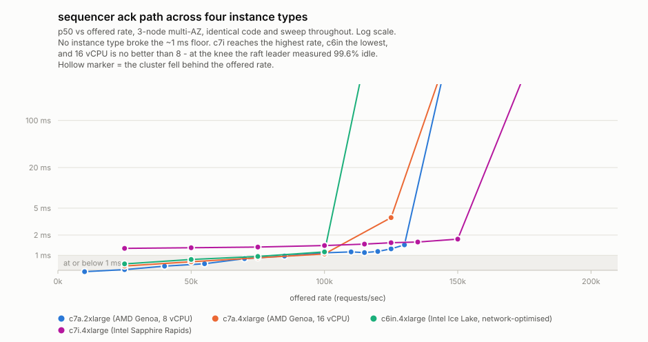
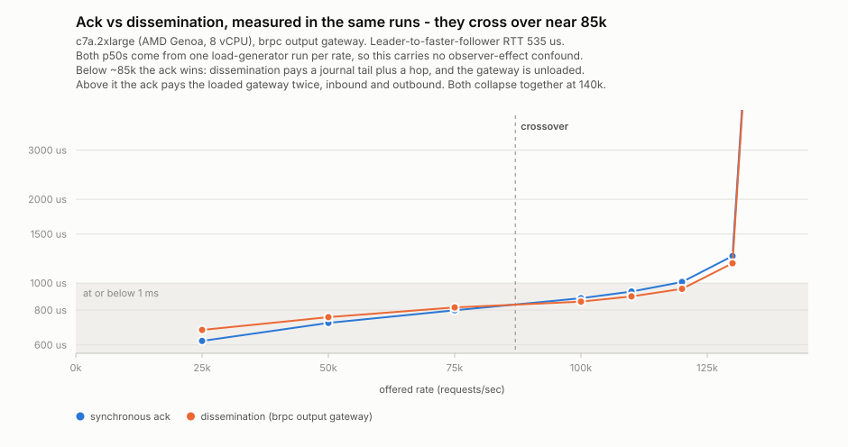
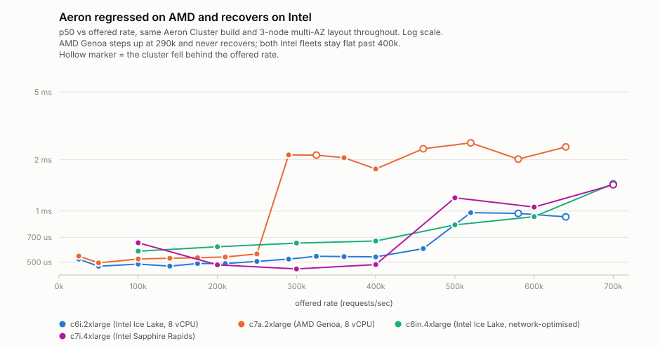

# sequencer

Benchmarks [sequencer](https://github.com/olegabu/sequencer) — a real
application framework, not a bespoke atomic-counter demo like
`braft`/`openraft`/`aeron` here — against this repo's own 3-node
multi-AZ fleet, following the root README's ["Adding a new raft
product"](../README.md#adding-a-new-raft-product) pattern. `APP`
selects which of sequencer's `examples/` this measures; `counter` is
its only one so far.

## The flavors

sequencer's own `bench/load_generator/README.md` names three round
trips; this Makefile drives two of them (the third, submission to
durable-in-the-journal, needs no separate rig — see that file for why):

1. **Submission to synchronous receipt** (`make client`) — client →
   input gateway → node → (raft commit, apply, journal append) → node
   → input gateway → client. Directly comparable to
   `../braft/client.cpp`'s own number, one hop longer through
   sequencer's own input gateway on purpose — that hop is what's being
   measured (specification.md §3.3: a real deployment never bypasses
   it). **A correct run can only be at or above bare braft's own
   floor, never below it** — a number that comes back *faster* than
   braft's own comfort-zone p50 means the rig isn't measuring a real
   round trip, not that sequencer is faster than what it's built on.
2. **Submission to receipt via the relay gateway** (`make
   client-relay`) — the same run, plus a second, separately-labeled
   summary (`relay_p50_us`, not `p50` — the two summaries are printed
   in the same log on purpose and must never collide) for how long
   dissemination to a remote, relay-fed consumer takes beyond the
   synchronous ack path. No other product here has a relay-gateway
   concept to compare against; this number stands on its own.

Both flavors submit the identical request stream at the identical
rate — `client-relay` does not re-run anything, it just also reports
what the relay side saw for the same traffic `client` already
generated.

## Prerequisites

1. Deploy the shared fleet from the repo root — see the [root
   README](../README.md).
2. `make build` — builds sequencer's Release preset from a sibling
   checkout (override `SEQUENCER_DIR` if yours isn't one).
3. `make push` — copies `counter_node`/`sequencer_relay` to the nodes,
   `counter_input_gateway`/`counter_load_generator` to the client.
4. `make start` — starts all of it; confirms in `make logs`
   (`state: LEADER` in the node's own std.log, or query
   `curl http://<node>:8300/raft_stat` directly).

Re-run `push`/`start` after every `make build` — `start` restarts
cleanly (PID-file based; safe to run again against already-running
processes) but never re-copies binaries itself.

## A single, reproducible run at a representative load

`RATE` defaults to `100000` — the same offered rate `braft/Makefile`
defaults to — so a plain `make client` / `make client-relay` with no
flags is already the load-close-to-braft's-own comparison point:

```sh
make client                 # phase 1, ~40s (10s warmup + 30s measure, RATE=100000)
make client-relay           # phase 1 and phase 3 together, same run
```

Check the summary's `failed` line is `0` (see sequencer's own commit
history for why this exists — a nonzero value here means the rig
measured how fast requests were *rejected*, not how fast they
succeeded, and every other number in the run is meaningless) and, for
`client-relay`, that `relay_dropped_races` is small relative to
`relay_completed`.

Override anything `braft/Makefile`'s own `client:` target exposes the
same way: `make client RATE=40000 WARMUP=5 MEASURE=15`.

## Results: five round trips on one fleet

Everything below comes from one `make sweep-all` followed by one
`make charts-all`, on 4x **c7a.2xlarge** (AMD Genoa, ~3.7 GHz, 8 vCPU),
3 nodes multi-AZ plus a colocated client, 5 s warmup / 20 s measure per
rate.


Each panel is one hop, on identical axes. Reading them side by side:
every dissemination path sits inside the shaded sub-millisecond band
through 100k, and they turn at essentially the same place. The
"direct to node" panel is the control arm described in [What the input
gateway costs](#what-the-input-gateway-costs) — not a deployable
configuration, and swept further than the shared axes show.


| round trip | p50 @ 100k | p99 @ 100k | last rate with p50 < 2 ms |
|---|---|---|---|
| synchronous ack | 1088 µs | 4835 µs | 130k |
| *(control)* direct to node, no gateway | ***727 µs*** | *2389 µs* | *250k* |
| relay gateway (gRPC) | **986 µs** | 2307 µs | 120k |
| output gateway, brpc | **910 µs** | 2935 µs | 130k |
| output gateway, gRPC | **903 µs** | 1987 µs | 125k |
| output gateway, WebSocket | **932 µs** | 3337 µs | 130k |

Every row here was re-measured after the input gateway learned to
batch proposals, since all of them except the control submit through
it. The output flavors moved in a direction worth naming:

| flavor | p50 @ 100k | last rate with p50 < 2 ms |
|---|---|---|
| brpc | 855 → 910 µs | 120k → 130k |
| gRPC | 864 → 903 µs | 115k → 125k |
| WebSocket | 892 → 932 µs | 120k → 130k |

**Each got ~45 µs slower at 100k and ~10k more headroom.** That is the
batching trade seen from the dissemination side, and it follows from
the asymmetry above: a dissemination pays only the gateway's *inbound*
leg, where grouping adds a little latency, and gets none of the
return-leg saving that makes the ack a clear win. What it does get is
the gateway no longer saturating, which is where the extra headroom
comes from. All three remain comfortably sub-millisecond.

The three output flavors are served by **one gateway process** on
three ports, sharing a single journal tail, codec pass and ring — so
unlike the earliest sweeps, their rows come from the same cluster
lifetime and the same traffic rather than three separate runs.

### Reading the table: what each round trip does and does not include

All six start from the *same* client send timestamp. They differ in
where they stop, and — importantly — in how much of the input gateway
they pay for:

- **Every row except the control passes through the input gateway on
  the way in.** The output-gateway rows are not gateway-free: their
  submissions go through `--input_gateway_addr` exactly like the ack's.
- **Only the ack pays for it twice.** Dissemination goes node →
  journal → output gateway (colocated with the node) → subscriber; it
  never travels back through the input gateway. That asymmetry is why
  the output flavors could sit below the ack path even though both
  include the gateway inbound — the ack's return leg was queueing
  behind a saturated gateway, and the dissemination path simply
  wasn't there.

Now that the gateway batches, the two have converged. Measured in the
*same runs* on one fleet at 100k:

| | ack p50 | dissemination p50 |
|---|---|---|
| output: brpc | 879 µs | 869 µs |
| output: gRPC | 904 µs | 876 µs |
| output: WebSocket | 914 µs | 911 µs |

**A measurement caveat that cuts across the tables.** The ack path
reads faster when an observer is attached to the same load generator:
on this fleet, at this instant, 1063-1076 µs with `make client` alone
against 879-914 µs in the runs above. That is reproducible and still
unexplained (it was noted earlier when the direct-arm work first hit
it, and ruling out node-side CPU idle states did not account for it).
It matters here because the sweep tables are built from `make sweep`
runs *without* an observer while every output-gateway number
necessarily comes from a run *with* one. Compare ack against
dissemination within a single run — as the small table above does —
rather than across the sweeps.

Two things worth stating plainly, because the headline is easy to
overstate:

- **The four gateway round trips are sub-millisecond at 100k; the
  synchronous ack path is not** (1366 µs). The ack path crosses 1 ms
  around 70k and stays above it. It is also the only one of the five
  that pays a full extra hop back through the input gateway.
- **The dissemination paths are *faster* than the ack path**, which
  looks backwards until you count hops: an output gateway tails the
  journal colocated with the node and pushes straight to its
  subscriber, while the ack has to travel back through the input
  gateway to the submitting client.

The knee sits at 120-130k across the five deployable round trips, with
the relay turning earliest and the ack path — since its gateway
learned to batch proposals — among the latest. The control arm has no
knee inside the swept range at all. Past it latency goes to whole seconds — the panels
clip those points rather than flatten the scale everything else lives
on. Note the p99 column is noisier than p50 and does not rank the same
way (gRPC has both the earliest knee and the *best* p99 at 100k); one
run per rate is not enough to separate those, so treat the p99 column
as indicative rather than a ranking.

## What the input gateway costs

Every number above submits through the input gateway, the path
specification.md §3.3 requires of a real deployment: client → input
gateway → node's `ProposeService` → back. `make client-direct` runs
the same rig against a node's `ProposeService` directly, which is not
a deployable configuration — it exists to price that hop.


| offered | before batching | batched | direct to node | gap before | gap after |
|---|---|---|---|---|---|
| 10k | 539 µs | 572 µs | 508 µs | 31 µs | 64 µs |
| 25k | 602 µs | 614 µs | 568 µs | 34 µs | 46 µs |
| 40k | 627 µs | 691 µs | 610 µs | 17 µs | 81 µs |
| 55k | 665 µs | 751 µs | 607 µs | 58 µs | 144 µs |
| 70k | 810 µs | 894 µs | 634 µs | 176 µs | 260 µs |
| 85k | 1281 µs | 976 µs | 659 µs | 622 µs | 317 µs |
| 100k | 1366 µs | 1088 µs | 727 µs | 639 µs | 361 µs |
| 115k | 1360 µs | 1099 µs | 739 µs | 621 µs | 360 µs |
| 125k | 1959 µs | 1248 µs | 784 µs | 1175 µs | 464 µs |
| 130k | 6039 µs | 1430 µs | 808 µs | 5231 µs | 622 µs |

**The hop was never expensive per request — the gateway just ran out
of capacity.** Below 55k it cost 17-58 µs, about right for an extra
localhost RPC and a JSON parse. From 70k the gap exploded: a second
knee, with the gateway saturating around 55-85k while the raft group
behind it runs flat to ~250k.

**Batching proposals moved that knee.** The gateway now sends several
client proposals per `ProposeBatch` RPC to the node instead of one
`Propose` each (sequencer's `gateway/input/README.md`). At 130k the
gap fell from 5231 µs to 622 µs and the gateway stopped collapsing —
its knee moved out past 130k, with 145k the first rate that breaks. At
100k, p50 went 1366 -> 1088 µs.

**It is a genuine trade, not a free win.** Below 70k batching is
*worse* — 691 against 627 µs at 40k — because a batch's latency is its
slowest member, so grouping costs something whenever the wire wasn't
the constraint in the first place. It buys 300 µs to 4.6 ms back from
85k up. The two bounds that control it (`--max_batch_size`,
`--max_inflight_batches`) were swept on the fleet rather than guessed;
see that README for the table.

The direct arm still holds sub-millisecond to 160k and under 2 ms at
250k, tracking bare braft's own ceiling (braft knees at ~250k here).
So sequencer's node adds very little to braft — 727 µs against 666 µs
at 100k — and **the input gateway remains the binding constraint on
the ack path, just a much later one than before.**

Two caveats on reading the direct arm, both real:

- It skips more than the network hop. It also skips
  `CounterInputCodec::toInput`'s JSON parse (the 8-byte input is built
  client-side, since `ProposeRequest` carries raw bytes). A deployment
  cannot skip either of those — something has to turn a client's wire
  format into an input.
- Its flags differ from `braft/`'s own sweep (`BURST=1` here versus
  `BURST=10` there), and the root README documents that burst shape
  inflating low-rate latency. Do not read "direct beats braft at 10k"
  (508 µs vs 641 µs) as sequencer outperforming what it is built on;
  that comparison needs matching burst settings before it means
  anything.

**One thing that was investigated and turned out not to be the
cause.** `NodeProposer::propose()` built a fresh `brpc::Channel` on
every request rather than reusing one. That is genuinely wrong —
channels are meant to be long-lived and shared — and it was fixed, but
measuring the fix put it at ~30 µs of the ~639 µs gap at 100k (p50
1351-1367 → 1311-1335). It shows up clearly at low rates, where it is
most of the hop's whole cost — the 10k gap fell from 52 µs to 31 µs —
and is lost in the noise at saturation. Worth doing, nowhere near an
explanation for the knee.

Two more were tried and measured before batching was: making the
Submit handler asynchronous instead of blocking a worker for the
node's round trip (**flat** — 1320-1374 µs before and after), and
raising the gateway's brpc worker count (**~10%**, and 512 workers is
worse than 256). What finally pointed at the answer was a `perf`
profile showing no application symbol near the top and a flat spread
of socket syscalls, kernel spinlocks and `try_to_wake_up` — the same
shape `gateway/output/` showed before *its* batching fix. What
actually produces the gateway's own knee is not established here;
profiling it the way `gateway/output/` was profiled is the obvious
next step.

## Does hardware move any of this? Four instance types say no

Everything above is one fleet. The obvious question is whether a
different one moves the numbers, so the same sweep was run on four
instance types — all 3-node multi-AZ, all the same code, all within
the account's 64 vCPU on-demand quota.



| fleet | silicon | p50 @ 100k | last healthy rate | peak achieved |
|---|---|---|---|---|
| **c7a.2xlarge** (8 vCPU) | AMD Genoa 3.7 GHz | **1088 µs** | 130k | ~133k |
| c7a.4xlarge (16 vCPU) | AMD Genoa 3.7 GHz | 1048 µs | 125k | ~133k |
| c6in.4xlarge (16 vCPU) | Intel Ice Lake 2.9 GHz, network-optimised | 1126 µs | 100k | ~111k |
| c7i.4xlarge (16 vCPU) | Intel Sapphire Rapids | 1398 µs | 150k | ~171k |

**Doubling the cores changed nothing.** c7a at 16 vCPU is no better
than at 8, and the reason is not subtle: sampled at 125k, right at the
knee, the raft **leader was 99.6% idle** and the client box 61.8%
idle. Whatever sets this ceiling, it is not CPU, so no amount of it
helps.

**The network-optimised instance was a bad bet.** `c6in` was chosen
deliberately — the input gateway's profile is dominated by socket
syscalls and thread wakeups, and this workload is small-packet and
high-PPS, so a high-PPS instance looked like the targeted answer. It
produced the *lowest* ceiling of the four (~111k). Ice Lake's slower
cores cost more than the network optimisation returned.

**c7i trades latency for headroom**: the worst p50 of the four but the
only fleet to get past 150k. That trade is real and not a measurement
artifact — `make node-rtt` puts its leader-to-faster-follower RTT at
504 µs against c7a's 535 µs, so it had the *better* network path and
was still slower per request.

Recording that RTT is worth doing on every fleet. Restarting instances
can land them on different physical paths, and the spread here
(387-843 µs across fleets over time) is large enough to swamp the
effect being measured. An earlier draft of this section blamed c7i's
latency on placement; measuring showed that was wrong.

### Ack and dissemination, from the same runs

The round-trip table above draws its ack from `make sweep` (no
observer) and its dissemination from `make sweep-output-multi` (necessarily
with one), and those are not comparable — see the observer caveat
there. Extracting both percentiles from the *same* load-generator runs
removes that problem entirely:



| rate | ack | dissemination | faster |
|---|---|---|---|
| 25k | **620 µs** | 679 µs | ack by 59 µs |
| 50k | **720 µs** | 755 µs | ack by 35 µs |
| 75k | **799 µs** | 818 µs | ack by 19 µs |
| 100k | 883 µs | **858 µs** | dissemination by 25 µs |
| 120k | 1009 µs | **954 µs** | dissemination by 55 µs |
| 130k | 1251 µs | **1178 µs** | dissemination by 73 µs |

**They cross over near 85k**, and that explains a comparison that
otherwise looks contradictory. Below the crossover the ack is faster:
dissemination pays a journal tail plus an extra hop, and the gateway
is unloaded so the ack's return leg is cheap. Above it the ack pays
the loaded gateway *twice*, inbound and outbound, while dissemination
never returns through it — so the gap opens as load rises. Both
collapse together at 140k.

This is also the best sequencer configuration measured anywhere in
this repo — c7a.2xlarge with the brpc output gateway, ack
sub-millisecond through 110k and dissemination through 120k — and it
is the *cheapest* fleet of the four.

### Aeron is the one product that cares which vendor

Not sequencer, but it came out of the same exercise and is the
clearest hardware finding here:



| fleet | p50 @ 100k | flat through | peak achieved |
|---|---|---|---|
| c6i.2xlarge (Intel Ice Lake) | 487 µs | 400k | ~640k |
| c7a.2xlarge (AMD Genoa) | 522 µs | **250k** | ~420k |
| c6in.4xlarge (Intel Ice Lake) | 580 µs | **600k** | ~655k |
| c7i.4xlarge (Intel Sapphire Rapids) | 650 µs | 400k | ~645k |

AMD steps up at 290k to ~2.1 ms and never recovers; both Intel fleets
stay flat past 400k, with `c6in` holding sub-millisecond to 600k.
braft and openraft both *improved* on the same AMD move, so this is
specific to Aeron — plausibly its heavy busy-spinning and
shared-memory buffers being more exposed to the memory subsystem, but
that is a hypothesis, not something these sweeps demonstrate.
**If you run Aeron, run it on Intel.**

### Reproducing these

Raw per-fleet CSVs are in [`fleets/`](fleets/), one per instance type,
in the same 10-column shape as every other sweep here. The three
charts regenerate from them with:

```sh
python3 ../sweep/mkcharts-fleets.py
```

That script is separate from `../sweep/mkcharts.py` on purpose: the
latter asks how one product behaves as load rises on one fleet, these
ask how one product behaves across fleets, which needs a series per
fleet rather than per product.

## Sweeping for the knee, and regenerating the chart

`make sweep-all` runs all five sweeps and `make charts-all` renders
every chart above; the individual targets below exist for re-running
one phase at a time. All of them are thin wrappers (see the Makefile
itself for the exact commands each one runs) so `make -n <target>`
always shows you the real underlying invocation, including this
section's own examples below.

### One sweep at a time, from a clean journal

```sh
make stop
make clean-data
make start
```

Two load generators (or a relay sweep and a phase-1 sweep) against one
fleet contend for the same client instance and neither result means
anything — sweep one flavor fully before starting the other, matching
`../sweep/README.md`'s own rule. `clean-data` before a sweep isn't
strictly required (`RelayObserver` fast-skips a pre-existing journal's
backlog rather than choking on it — see sequencer's own git history
for the bug that mattered until it was fixed), but it keeps every
point's own `achieved` honestly describing that point's own traffic
rather than an ever-growing prior journal, and it's a good habit even
though the sequencer-side bug that once made this matter more —
`JournalWriter::append: index file exhausted`, a node crashing
mid-sweep once its journal's fixed-capacity index filled up — is now
fixed at the source (`JournalOptions`'s own defaults raised, not a
rig workaround).

### Phase 1: `make sweep`

```sh
make sweep                                   # SWEEP_RATES's own default, into seq.csv
make sweep SWEEP_RATES="10000 40000 100000"  # a narrower/faster pass
make sweep SWEEP_CSV=/tmp/run2.csv           # a different output file
```

Wraps `../sweep/sweep.sh` unmodified — shared by every product in this
repo, and already speaks sequencer's `client` target's exact flag
names (§8.5's whole point, per sequencer's own `client:` comment), so
no sequencer-specific handling was needed there. `SWEEP_RATES`'
default is a *starting point*, not a known comfort zone — sequencer
adds a real hop on top of bare braft, so its knee is somewhere at or
below braft's own ~160k, not necessarily at the same place; narrow or
widen it once a first pass shows roughly where it turns (see
`../sweep/README.md`'s own "Rates are spaced tightest inside each
product's comfort zone and through its knee" for why the spacing
matters more than the exact endpoints).

### The control arm: `make sweep-direct`

```sh
make client-direct              # one run, straight to NODE1's ProposeService
make sweep-direct               # the same sweep, into seq-direct.csv
```

Writes rows tagged `product=sequencer-direct`. See "What the input
gateway costs" above for what this arm does and does not skip.

### Phase 3: `make sweep-relay`

```sh
make sweep-relay
```

`sweep.sh`'s own CSV extraction greps bare `p50`/`p90`/etc. labels —
exactly what sequencer's relay summary deliberately does *not* use
(see `bench/load_generator/README.md`), so it has nothing to grab for
phase 3. `sweep-relay.sh` (this directory, not shared) is the same
idea, reading `relay_p50_us` et al. instead, into the same 10-column
shape so `mkcharts.py` reads it identically. Uses the same
`SWEEP_RATES`/`SWEEP_WARMUP`/`SWEEP_MEASURE` as `sweep`, writing
`SWEEP_RELAY_CSV` (default `seq-relay.csv`) instead of `SWEEP_CSV`.

### Phase 4: `make sweep-output-multi-all`

```sh
make sweep-output-multi-all                            # all three flavors, into seq-output-multi.csv
make sweep-output-multi OUTPUT_GATEWAY_FLAVOR=grpc     # just one (its gateway must already be up)
```

The output-gateway counterpart, driven from **all five client boxes**
via `../sweep/sweep-multi.sh`, and appending all three flavors into one
CSV tagged `product=sequencer-output-<flavor>`. One gateway process
serves all three protocols at once, so a single cluster lifetime covers
the lot and what differs between the curves is the subscribe protocol
and nothing else.

It drives from five boxes because the single-box version it replaced
(`sweep-output.sh`, deleted) was measuring its own client: all three
flavors "kneed" at exactly 145k with the load generator's schedule lag
jumping from ~100 µs to over half a second, which is a client falling
over rather than a gateway. The same gateways run past 200k when five
boxes share the offered rate.

Two things this depends on, both easy to get wrong:

- `--output_hdr_raw_out`, not `--hdr_raw_out`. The merge has to combine
  the **output** path's histograms; `--hdr_raw_out` writes the ack
  path's, and merging those would quietly report a different round trip.
  Percentiles cannot be averaged across clients — see `merge-hdr.py`.
- Per-client topics. `CounterOutputCodec` publishes to the submitting
  client's own `totals-<id>`, so each subscriber receives only its own
  traffic. On one shared topic the gateway's delivery load is
  (rate × subscribers), and each client parses five times what it needs.

### Everything at once: `make sweep-all`

```sh
make sweep-all
```

All five round trips — phase 1, phase 3, and phase 4's three flavors —
from a clean journal, in one command. This is the single reproducible
entry point behind every sequencer chart below. It is long (five full
rate sweeps); narrow `SWEEP_RATES` for a faster pass.

### Generating the charts: `make charts-all`

```sh
make charts-all     # every sequencer chart, from all three CSVs at once
make chart          # just SWEEP_CSV        -> knee-sequencer.svg
make chart-relay    # just SWEEP_RELAY_CSV  -> knee-sequencer-relay.svg
make chart-output   # just SWEEP_OUTPUT_CSV -> knee-sequencer-output-*.svg
```

`../sweep/mkcharts.py` takes **any number of CSVs** — every row carries
its own `product` column, so several sweeps' files merge into one
dataset. That is why `charts-all` hands it all three at once rather
than calling it three times: the two cross-round-trip charts can only
be drawn by an invocation that sees every phase together.

It writes, from a full `sweep-all`:

| File | What it shows |
|---|---|
| `round-trips.svg` | Small multiples, one panel per round trip, each with p50 **and** p99 on identical axes. |
| `round-trips-p50.svg` | The same five overlaid, p50 only — the "do they land on top of each other?" view. |
| `knee-sequencer.svg` | Phase 1 alone, p50 + p99. |
| `knee-sequencer-relay.svg` | Phase 3 alone, p50 + p99. |
| `knee-sequencer-output-{brpc,grpc,websocket}.svg` | Each output flavor alone, p50 + p99. |

Per-product axis ranges live in `mkcharts.py`'s `CFG` dict, keyed by
product name; entries for all five sequencer products already exist.
If you sweep a range the current axes don't cover, adjust that entry —
`(xmax, xstep, (ylow,yhigh), yticks, comfort_rate, markers, title,
subtitle)`, read off the data by hand rather than fitted, the same way
`../sweep/README.md` describes for the original three.

The combined `knee-curves.svg` (aeron/braft/openraft on one chart)
stays scoped to those three; sequencer's own comparison is
`round-trips.svg`.

## The residual tail, located

Taking segment creation and sealing off the apply thread removed the
systematic stall, and moving the resume-position write off the delivery
thread removed most of what was left. Five 200k runs, before and after:

| | p999 across five 200k runs | worst max |
|---|---|---|
| before | 8,224 - 30,320 us, plus occasional 60-105 ms windows | ~105 ms |
| after | 3,932 - 4,640 us | 10.7 ms |

The spread is 7.7x tighter and no 60-105 ms window appeared.

**Where the rest of it is.** The apply loop reports its own stalls by
phase (`SEQ_APPLY_STALL_US`), and with the probe armed -- verified in
`/proc/<pid>/environ`, not assumed -- a probed ladder to 325k caught
in-window stalls that all look like this:

```
[apply-stall] gap=10371us sm=0us journal=0us notify=10us total=10us
[apply-stall] gap= 7494us sm=0us journal=0us notify= 9us total= 9us
[apply-stall] gap= 6745us sm=0us journal=0us notify= 4us total= 4us
```

A 5-10 ms gap with every phase at 0-10 us means the apply loop was
**idle**: nothing was waiting for it. The state machine, the journal
append and the completion callback together account for under 10 us,
so the wait is upstream of all of them -- in braft's replication path,
not in anything this repository owns. `journal=0us` is also the
segment-rollover fix showing up directly.

That is the answer to "what is the remaining tail": it is consensus,
measured rather than argued. Note also that the probe proved itself
non-vacuous in the same run -- the largest gaps it logged were the ~30 s
idle pauses BETWEEN measurement runs, which is exactly what an armed
instrument should report and what a silent one could not.

For scale, bare braft on the same fleet has p999 7,944us at 200k. Our
own 200k p999 is now 4,372 us (gRPC) to 5,908 us (brpc), but the two
are not measuring the same thing -- braft's harness times raw ops and
ours times submission to journal-observed delivery -- so treat that as
an order-of-magnitude check, not a ranking.

What is still not explained is a rare LARGER window: WebSocket at 200k
in the full sweep showed p999 32,352 us with a 53 ms max, in one rate
of fifty-one. Five probed 200k repeats and a probed eight-rate ladder
did not reproduce one, so it remains uncaught rather than understood.
Catching it needs a long probed run, not another hypothesis.

## Sweeps die of open file descriptors, silently

Worth knowing before trusting any long ladder. braft keeps one open fd
per raft log segment and truncates only on snapshot, so a sweep
accumulates them until the process hits its limit:

```
E log.cpp:1203] Fail to close old open_segment or create new
  open_segment path: .../log: Too many open files [24]
W node ... is not in active state current_term 2 state ERROR
```

**braft latches the node into ERROR and does not recover.** The process
keeps running and listening while every proposal fails, so the sweep
carries on and writes rows full of zeros. Nothing fails loudly.

This is what produced the seam in `seq-output-multi.csv`, where brpc
and gRPC came from one cluster lifetime and WebSocket from another: a
combined run reached 1008 segments during brpc's post-knee rates and
every one of the seventeen WebSocket rates afterwards recorded nothing.
The Makefile now raises the soft limit to 65536 at every launch site
(the hard limit was already ~1M, so it needs no privilege). The sweep
that produced the current CSV ended at 1569 segments -- past the old
1024 ceiling, so the fix is load-bearing, not precautionary.
