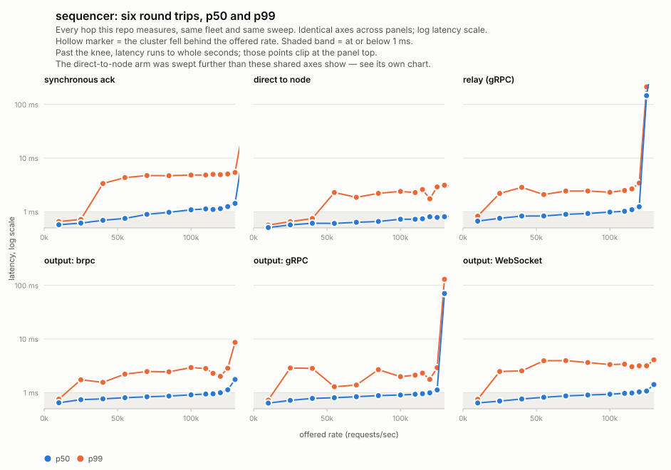
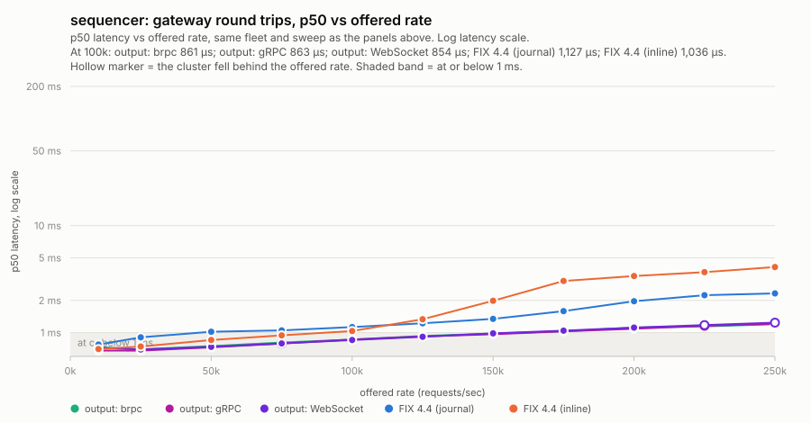
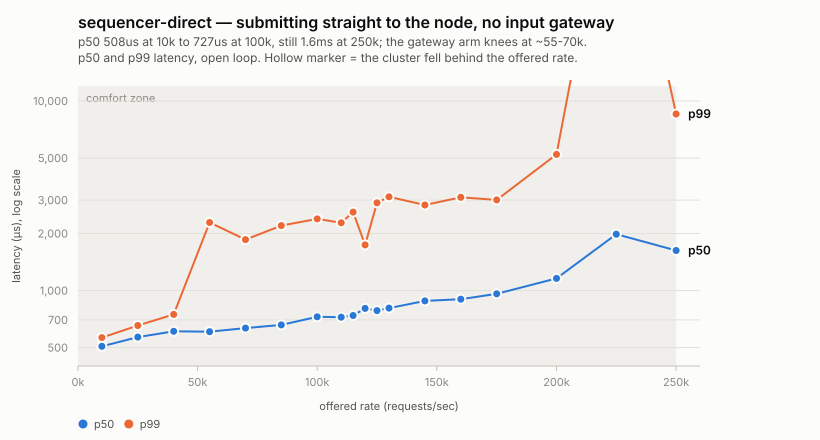

# sequencer

Benchmarks [sequencer](https://github.com/olegabu/sequencer) — a real
application framework, not a bespoke atomic-counter demo like
`braft`/`openraft`/`aeron` here — against this repo's own 3-node
multi-AZ fleet, following the root README's ["Adding a new raft
product"](../README.md#adding-a-new-raft-product) pattern. `APP`
selects which of sequencer's `examples/` this measures; `counter` is
its only one so far.

## The flavors

sequencer's own `bench/load_generator/README.md` names three round
trips; this Makefile drives two of them (the third, submission to
durable-in-the-journal, needs no separate rig — see that file for why):

1. **Submission to synchronous receipt** (`make client`) — client →
   input gateway → node → (raft commit, apply, journal append) → node
   → input gateway → client. Directly comparable to
   `../braft/client.cpp`'s own number, one hop longer through
   sequencer's own input gateway on purpose — that hop is what's being
   measured (specification.md §3.3: a real deployment never bypasses
   it). **A correct run can only be at or above bare braft's own
   floor, never below it** — a number that comes back *faster* than
   braft's own comfort-zone p50 means the rig isn't measuring a real
   round trip, not that sequencer is faster than what it's built on.
2. **Submission to receipt via the relay gateway** (`make
   client-relay`) — the same run, plus a second, separately-labeled
   summary (`relay_p50_us`, not `p50` — the two summaries are printed
   in the same log on purpose and must never collide) for how long
   dissemination to a remote, relay-fed consumer takes beyond the
   synchronous ack path. No other product here has a relay-gateway
   concept to compare against; this number stands on its own.

Both flavors submit the identical request stream at the identical
rate — `client-relay` does not re-run anything, it just also reports
what the relay side saw for the same traffic `client` already
generated.

## Prerequisites

1. Deploy the shared fleet from the repo root — see the [root
   README](../README.md).
2. `make build` — builds sequencer's Release preset from a sibling
   checkout (override `SEQUENCER_DIR` if yours isn't one).
3. `make push` — copies `counter_node`/`sequencer_relay` to the nodes,
   `counter_input_gateway`/`counter_load_generator` to the client.
4. `make start` — starts all of it; confirms in `make logs`
   (`state: LEADER` in the node's own std.log, or query
   `curl http://<node>:8300/raft_stat` directly).

Re-run `push`/`start` after every `make build` — `start` restarts
cleanly (PID-file based; safe to run again against already-running
processes) but never re-copies binaries itself.

## A single, reproducible run at a representative load

`RATE` defaults to `100000` — the same offered rate `braft/Makefile`
defaults to — so a plain `make client` / `make client-relay` with no
flags is already the load-close-to-braft's-own comparison point:

```sh
make client                 # phase 1, ~40s (10s warmup + 30s measure, RATE=100000)
make client-relay           # phase 1 and phase 3 together, same run
```

Check the summary's `failed` line is `0` (see sequencer's own commit
history for why this exists — a nonzero value here means the rig
measured how fast requests were *rejected*, not how fast they
succeeded, and every other number in the run is meaningless) and, for
`client-relay`, that `relay_dropped_races` is small relative to
`relay_completed`.

Override anything `braft/Makefile`'s own `client:` target exposes the
same way: `make client RATE=40000 WARMUP=5 MEASURE=15`.

## Results: five round trips on one fleet

Everything below comes from one `make sweep-all` followed by one
`make charts-all`, on 4x **c7a.2xlarge** (AMD Genoa, ~3.7 GHz, 8 vCPU),
3 nodes multi-AZ plus a colocated client, 5 s warmup / 20 s measure per
rate.



Each panel is one hop, on identical axes. Reading them side by side:
every dissemination path sits inside the shaded sub-millisecond band
through 100k, and they turn at essentially the same place. The
"direct to node" panel is the control arm described in [What the input
gateway costs](#what-the-input-gateway-costs) — not a deployable
configuration, and swept further than the shared axes show.



| round trip | p50 @ 100k | p99 @ 100k | last rate with p50 < 2 ms |
|---|---|---|---|
| synchronous ack | 1088 µs | 4835 µs | 130k |
| *(control)* direct to node, no gateway | *727 µs* | *2389 µs* | *250k+* |
| relay gateway (gRPC) | **986 µs** | 2307 µs | 120k |
| output gateway, brpc | **855 µs** | 1876 µs | 120k |
| output gateway, gRPC | **864 µs** | 1785 µs | 115k |
| output gateway, WebSocket | **892 µs** | 3877 µs | 120k |

The three output flavors are now served by **one gateway process** on
three ports, sharing a single journal tail, codec pass and ring — so
unlike every earlier sweep, their rows come from the same cluster
lifetime and the same traffic rather than three separate runs. Against
the previous three-process numbers, the comfort zone is unchanged
within noise (brpc +1-3%, gRPC +1%) and WebSocket is 6-9% *faster*
across the range, which is where the text-to-binary framing fix shows
up: text frames made Beast UTF-8-validate every write.

Two things worth stating plainly, because the headline is easy to
overstate:

- **The four gateway round trips are sub-millisecond at 100k; the
  synchronous ack path is not** (1366 µs). The ack path crosses 1 ms
  around 70k and stays above it. It is also the only one of the five
  that pays a full extra hop back through the input gateway.
- **The dissemination paths are *faster* than the ack path**, which
  looks backwards until you count hops: an output gateway tails the
  journal colocated with the node and pushes straight to its
  subscriber, while the ack has to travel back through the input
  gateway to the submitting client.

The knee sits at 115-130k across the six, with the gRPC output flavor
turning earliest and the ack path — since its gateway learned to batch
proposals — now among the latest. Past it latency goes to whole seconds — the panels
clip those points rather than flatten the scale everything else lives
on. Note the p99 column is noisier than p50 and does not rank the same
way (gRPC has both the earliest knee and the *best* p99 at 100k); one
run per rate is not enough to separate those, so treat the p99 column
as indicative rather than a ranking.

## What the input gateway costs

Every number above submits through the input gateway, the path
specification.md §3.3 requires of a real deployment: client → input
gateway → node's `ProposeService` → back. `make client-direct` runs
the same rig against a node's `ProposeService` directly, which is not
a deployable configuration — it exists to price that hop.



| offered | before batching | batched | direct to node | gap before | gap after |
|---|---|---|---|---|---|
| 10k | 539 µs | 572 µs | 508 µs | 31 µs | 64 µs |
| 25k | 602 µs | 614 µs | 568 µs | 34 µs | 46 µs |
| 40k | 627 µs | 691 µs | 610 µs | 17 µs | 81 µs |
| 55k | 665 µs | 751 µs | 607 µs | 58 µs | 144 µs |
| 70k | 810 µs | 894 µs | 634 µs | 176 µs | 260 µs |
| 85k | 1281 µs | 976 µs | 659 µs | 622 µs | 317 µs |
| 100k | 1366 µs | 1088 µs | 727 µs | 639 µs | 361 µs |
| 115k | 1360 µs | 1099 µs | 739 µs | 621 µs | 360 µs |
| 125k | 1959 µs | 1248 µs | 784 µs | 1175 µs | 464 µs |
| 130k | 6039 µs | 1430 µs | 808 µs | 5231 µs | 622 µs |

**The hop was never expensive per request — the gateway just ran out
of capacity.** Below 55k it cost 17-58 µs, about right for an extra
localhost RPC and a JSON parse. From 70k the gap exploded: a second
knee, with the gateway saturating around 55-85k while the raft group
behind it runs flat to ~250k.

**Batching proposals moved that knee.** The gateway now sends several
client proposals per `ProposeBatch` RPC to the node instead of one
`Propose` each (sequencer's `gateway/input/README.md`). At 130k the
gap fell from 5231 µs to 622 µs and the gateway stopped collapsing —
its knee moved out past 130k, with 145k the first rate that breaks. At
100k, p50 went 1366 -> 1088 µs.

**It is a genuine trade, not a free win.** Below 70k batching is
*worse* — 691 against 627 µs at 40k — because a batch's latency is its
slowest member, so grouping costs something whenever the wire wasn't
the constraint in the first place. It buys 300 µs to 4.6 ms back from
85k up. The two bounds that control it (`--max_batch_size`,
`--max_inflight_batches`) were swept on the fleet rather than guessed;
see that README for the table.

The direct arm still holds sub-millisecond to 160k and under 2 ms at
250k, tracking bare braft's own ceiling (braft knees at ~250k here).
So sequencer's node adds very little to braft — 727 µs against 666 µs
at 100k — and **the input gateway remains the binding constraint on
the ack path, just a much later one than before.**

Two caveats on reading the direct arm, both real:

- It skips more than the network hop. It also skips
  `CounterInputCodec::toInput`'s JSON parse (the 8-byte input is built
  client-side, since `ProposeRequest` carries raw bytes). A deployment
  cannot skip either of those — something has to turn a client's wire
  format into an input.
- Its flags differ from `braft/`'s own sweep (`BURST=1` here versus
  `BURST=10` there), and the root README documents that burst shape
  inflating low-rate latency. Do not read "direct beats braft at 10k"
  (508 µs vs 641 µs) as sequencer outperforming what it is built on;
  that comparison needs matching burst settings before it means
  anything.

**One thing that was investigated and turned out not to be the
cause.** `NodeProposer::propose()` built a fresh `brpc::Channel` on
every request rather than reusing one. That is genuinely wrong —
channels are meant to be long-lived and shared — and it was fixed, but
measuring the fix put it at ~30 µs of the ~639 µs gap at 100k (p50
1351-1367 → 1311-1335). It shows up clearly at low rates, where it is
most of the hop's whole cost — the 10k gap fell from 52 µs to 31 µs —
and is lost in the noise at saturation. Worth doing, nowhere near an
explanation for the knee.

Two more were tried and measured before batching was: making the
Submit handler asynchronous instead of blocking a worker for the
node's round trip (**flat** — 1320-1374 µs before and after), and
raising the gateway's brpc worker count (**~10%**, and 512 workers is
worse than 256). What finally pointed at the answer was a `perf`
profile showing no application symbol near the top and a flat spread
of socket syscalls, kernel spinlocks and `try_to_wake_up` — the same
shape `gateway/output/` showed before *its* batching fix. What
actually produces the gateway's own knee is not established here;
profiling it the way `gateway/output/` was profiled is the obvious
next step.

## Sweeping for the knee, and regenerating the chart

`make sweep-all` runs all five sweeps and `make charts-all` renders
every chart above; the individual targets below exist for re-running
one phase at a time. All of them are thin wrappers (see the Makefile
itself for the exact commands each one runs) so `make -n <target>`
always shows you the real underlying invocation, including this
section's own examples below.

### One sweep at a time, from a clean journal

```sh
make stop
make clean-data
make start
```

Two load generators (or a relay sweep and a phase-1 sweep) against one
fleet contend for the same client instance and neither result means
anything — sweep one flavor fully before starting the other, matching
`../sweep/README.md`'s own rule. `clean-data` before a sweep isn't
strictly required (`RelayObserver` fast-skips a pre-existing journal's
backlog rather than choking on it — see sequencer's own git history
for the bug that mattered until it was fixed), but it keeps every
point's own `achieved` honestly describing that point's own traffic
rather than an ever-growing prior journal, and it's a good habit even
though the sequencer-side bug that once made this matter more —
`JournalWriter::append: index file exhausted`, a node crashing
mid-sweep once its journal's fixed-capacity index filled up — is now
fixed at the source (`JournalOptions`'s own defaults raised, not a
rig workaround).

### Phase 1: `make sweep`

```sh
make sweep                                   # SWEEP_RATES's own default, into seq.csv
make sweep SWEEP_RATES="10000 40000 100000"  # a narrower/faster pass
make sweep SWEEP_CSV=/tmp/run2.csv           # a different output file
```

Wraps `../sweep/sweep.sh` unmodified — shared by every product in this
repo, and already speaks sequencer's `client` target's exact flag
names (§8.5's whole point, per sequencer's own `client:` comment), so
no sequencer-specific handling was needed there. `SWEEP_RATES`'
default is a *starting point*, not a known comfort zone — sequencer
adds a real hop on top of bare braft, so its knee is somewhere at or
below braft's own ~160k, not necessarily at the same place; narrow or
widen it once a first pass shows roughly where it turns (see
`../sweep/README.md`'s own "Rates are spaced tightest inside each
product's comfort zone and through its knee" for why the spacing
matters more than the exact endpoints).

### The control arm: `make sweep-direct`

```sh
make client-direct              # one run, straight to NODE1's ProposeService
make sweep-direct               # the same sweep, into seq-direct.csv
```

Writes rows tagged `product=sequencer-direct`. See "What the input
gateway costs" above for what this arm does and does not skip.

### Phase 3: `make sweep-relay`

```sh
make sweep-relay
```

`sweep.sh`'s own CSV extraction greps bare `p50`/`p90`/etc. labels —
exactly what sequencer's relay summary deliberately does *not* use
(see `bench/load_generator/README.md`), so it has nothing to grab for
phase 3. `sweep-relay.sh` (this directory, not shared) is the same
idea, reading `relay_p50_us` et al. instead, into the same 10-column
shape so `mkcharts.py` reads it identically. Uses the same
`SWEEP_RATES`/`SWEEP_WARMUP`/`SWEEP_MEASURE` as `sweep`, writing
`SWEEP_RELAY_CSV` (default `seq-relay.csv`) instead of `SWEEP_CSV`.

### Phase 4: `make sweep-output-all`

```sh
make sweep-output-all                             # all three flavors, into seq-output.csv
make sweep-output OUTPUT_GATEWAY_FLAVOR=grpc      # just one (its gateway must already be up)
```

The output-gateway counterpart, via `sweep-output.sh` — same idea
again, reading the flavor-namespaced `output_<flavor>_p50_us` labels.
Only one output gateway can run at a time (all three flavors share
`OUTPUT_GATEWAY_PORT` and one pidfile), so `sweep-output-all` gives
each flavor its own full stop / `clean-data` / start cycle before
sweeping it, and appends all three into one CSV tagged
`product=sequencer-output-<flavor>`.

### Everything at once: `make sweep-all`

```sh
make sweep-all
```

All five round trips — phase 1, phase 3, and phase 4's three flavors —
from a clean journal, in one command. This is the single reproducible
entry point behind every sequencer chart below. It is long (five full
rate sweeps); narrow `SWEEP_RATES` for a faster pass.

### Generating the charts: `make charts-all`

```sh
make charts-all     # every sequencer chart, from all three CSVs at once
make chart          # just SWEEP_CSV        -> knee-sequencer.svg
make chart-relay    # just SWEEP_RELAY_CSV  -> knee-sequencer-relay.svg
make chart-output   # just SWEEP_OUTPUT_CSV -> knee-sequencer-output-*.svg
```

`../sweep/mkcharts.py` takes **any number of CSVs** — every row carries
its own `product` column, so several sweeps' files merge into one
dataset. That is why `charts-all` hands it all three at once rather
than calling it three times: the two cross-round-trip charts can only
be drawn by an invocation that sees every phase together.

It writes, from a full `sweep-all`:

| File | What it shows |
|---|---|
| `round-trips.svg` | Small multiples, one panel per round trip, each with p50 **and** p99 on identical axes. |
| `round-trips-p50.svg` | The same five overlaid, p50 only — the "do they land on top of each other?" view. |
| `knee-sequencer.svg` | Phase 1 alone, p50 + p99. |
| `knee-sequencer-relay.svg` | Phase 3 alone, p50 + p99. |
| `knee-sequencer-output-{brpc,grpc,websocket}.svg` | Each output flavor alone, p50 + p99. |

Per-product axis ranges live in `mkcharts.py`'s `CFG` dict, keyed by
product name; entries for all five sequencer products already exist.
If you sweep a range the current axes don't cover, adjust that entry —
`(xmax, xstep, (ylow,yhigh), yticks, comfort_rate, markers, title,
subtitle)`, read off the data by hand rather than fitted, the same way
`../sweep/README.md` describes for the original three.

The combined `knee-curves.svg` (aeron/braft/openraft on one chart)
stays scoped to those three; sequencer's own comparison is
`round-trips.svg`.
